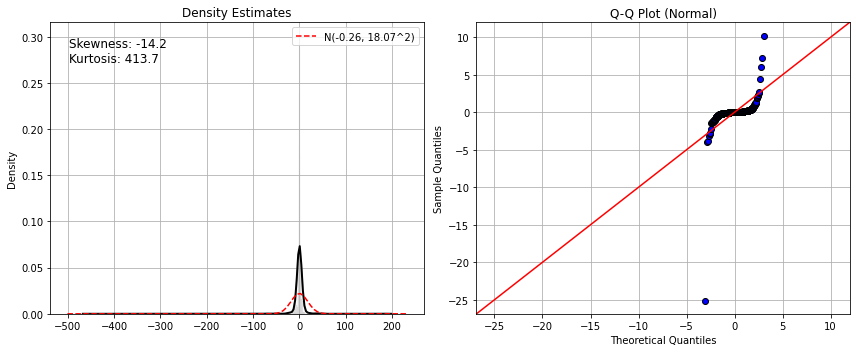
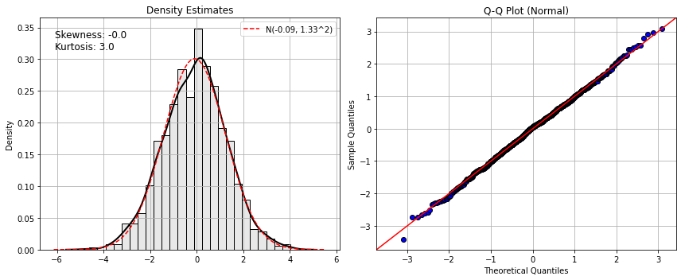
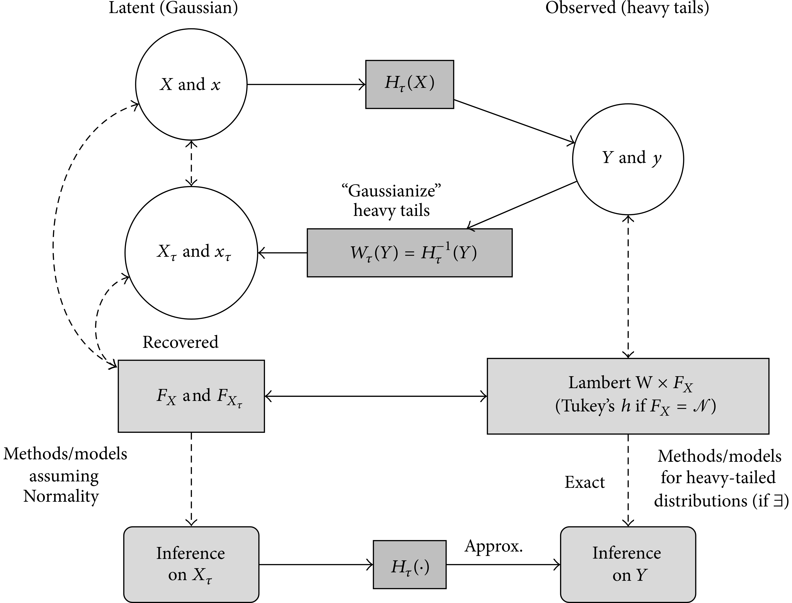

# pylambertw: Probabilistic Models to Analyze and Gaussianize Heavy-Tailed, Skewed Data


[](http://makeapullrequest.com)
[](https://lbesson.mit-license.org/)


See https://github.com/gmgeorg/pylambertw/issues for remaining issues/TODOs.

---

# Overview

`pylambertw` is a module to analyze & transform skewed, heavy-tailed data using Lambert W x F distributions.

First and foremost, the `pylambertw` tries to replicate functionality in the [**LambertW**](https://github.com/gmgeorg/LambertW) R package.  Under the hood, `pylambertw` is built on **pytorch** and the [`torchlambertw` library](https://github.com/gmgeorg/torchlambertw), which implements the Lambert W function and Lambert W x F distributions.

It provides an sklearn-like API for estimation and transformation of data.

```python
import pylambertw
from pylambertw.utils import plot
import numpy as np

np.random.seed(42)
y = np.random.standard_cauchy(size=1000)

plot.test_norm(y)
```



```python
import pylambertw.igmm
clf = pylambertw.igmm.IGMM()
clf.fit(y)

x = clf.transform(y)
plot.test_norm(x)
```


## Sklearn Transformer API

This can also be used as a generic `Gaussianizer()` with a fully compatible sklearn
API `Transformer.Mixin`.

```python
rng = np.random.RandomState(seed=42)
X = rng.standard_cauchy(size=(1000, 2))

print(pylambertw.utils.moments.skewness(X), pylambertw.utils.moments.kurtosis(X))

> [-29.96366924  30.54780708] [929.58443573 953.16027739]
```

`pylambertw` provides the sklearn transformer to remove the heavy-tails:

```python
clf = gaussianizing.Gaussianizer(lambertw_type="h", method="igmm")
clf.fit(X)

X_gauss = clf.transform(X)

print(pylambertw.utils.moments.skewness(X_gauss),pylambertw.utils.moments.kurtosis(X_gauss))

> [0.00728701 0.13284473] [2.99999955 2.99999953]
```


## Installation

It can be installed directly from GitHub using:

```python
pip install git+https://github.com/gmgeorg/pylambertw.git
```


### In a nutshell

Lambert W x F distributions are a generalized family of distributions, that take an "input" X ~ F and transform it to a skewed and/or heavy-tailed output, Y ~ Lambert W x F, via a particularly parameterized transformation.  See Goerg (2011, 2015) for details.




For parameter values of 0, the new variable collapses to X, which means that Lambert W x F distributions always contain the original base distribution F as a special case.  Ie it does not hurt to impose a Lambert W x F distribution on your data; worst case, parameter estimates are 0 and you get F back; best case: you properly account for skewness & heavy-tails in your data and can even remove it (by transforming data back to having X ~ F). The such obtained random variable / data / distribution is then a Lambert W x F distribution.

The convenient part about this is that when working with data y1, ..., yn, you can estimate the transformation from the data and transform it back into the (unobserved) x1, ..., xn.  This is particularly useful when X ~ Normal(loc, scale), as then you can "Gaussianize" your data.

**Important**: The `torch.distributions` framework allows you to easily build *any* Lambert W x F
distribution by just using the skewed & heavy tail Lambert W transform here implemented here and pass whatever `base_distribution` -- that's F -- makes sense to you. Voila! You have just built a Lambert W x F distribution.

See [demo notebook](notebooks/demo-maximum-likelihood-lambertw-f.ipynb) for details.


## Tutorials & posts

See cross-validated / stackoverflow for [a variety of **LambertW** posts](https://stats.stackexchange.com/search?q=LambertW) on how to normalize/Gaussianize data and model skewed/heavy-tailed distributions.


## Related work

* [**LambertW** R package](https://github.com/gmgeorg/LambertW): `pylambertw` aims to be the companion Python module to [**LambertW**](https://github.com/gmgeorg/LambertW).  If there is any functionality in the R package that's not available here, file an issue at https://github.com/gmgeorg/pylambertw/issues. Contributing PRs are welcome!  If in doubt about functionality either clarify in the issues page or just default to the R functionality.

* [**gaussianize**](https://github.com/gregversteeg/gaussianize): a Python module to Gaussianize data using Box-Cox & Lambert W transformations.


## References

Georg M. Goerg (2011): [*Lambert W random variables - a new family of generalized skewed distributions with applications to risk estimation*](https://projecteuclid.org/euclid.aoas/1318514301). Annals of Applied Statistics 3(5). 2197-2230.

Georg M. Goerg (2014): [*The Lambert Way to Gaussianize heavy-tailed data with the inverse of Tukey's h transformation as a special case*](https://downloads.hindawi.com/journals/tswj/2015/909231.pdf). The Scientific World Journal.

Georg M. Goerg (2016): [*Rebuttal of the 'Letter to the Editor' of Annals of Applied Statistics on Lambert W x F Distributions and the IGMM Algorithm*]( https://arxiv.org/abs/1602.02200)

# License

This project is licensed under the terms of the [MIT license](LICENSE).
